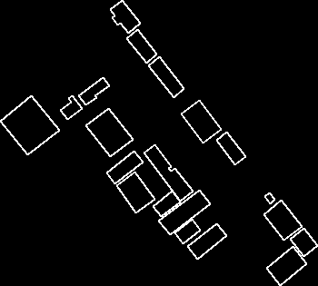
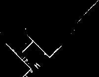
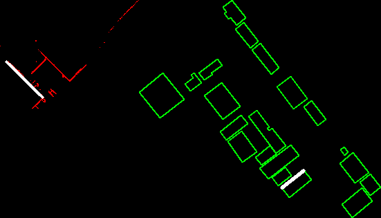

# Overview
This is a cross-view matching pipeline that takes ground and aerial datasets (image set) as inputs and eastimate their 7DoF transformation (scale, rotation, translation). It support aligning ground data onto air or footprint data. 

# Requirement   

It is mainly written in python, requiring "open3d","opencv","scipy","skimage","rdp".  
The line extraction module is based on [DeepLSD](https://github.com/cvg/DeepLSD).

# Input data
Both air and ground dataset are image set, where each dataset is first processed by colmap to get the sparse model, and then produce dense point cloud with semantics label using https://github.com/GDAOSU/semantic_dense_pointcloud. Then the dense point cloud with semantics are the input for our pipeline. Please refer to "test_data" folder.  

# Usage
It supports two mode: 1. ground-to-air data, 2. ground-to-footprint data. 
Input arguments:  
**ground_path** line 3566,   
**drone_path or footprint** line 3567,  
 **out_dir** line 3568.

Please refer to "test_data" folder. 
```
python src/match.py --footprint_kml=your_footprint_kml_file [--site_json=your_boundingbox_json_file] --ground_ply=your_ground_semantic_point_cloud_file --out_dir=your_output_dir
```

## Results
The top-down view building boundary for both air and ground data are visualized in "out_dir/footprint_img.png", "out_dir/ground_facade_img.png".   
  


The line-based matching intermediate results are in "out_dir" where "out_dir/match_0*.png" is the best matching result, "out_dir/warp_src_line_0.png" is the warped ground data result.   


The transforamtion information is stored in "out_dir/transformation.txt". We choose the best transformation solution based on the *overlap* metrics. It is more robust than other metrics under 7DoF estimation setting. 

# Contact
Please contact: xu.3961@buckeyemail.osu.edu if you have any questions
